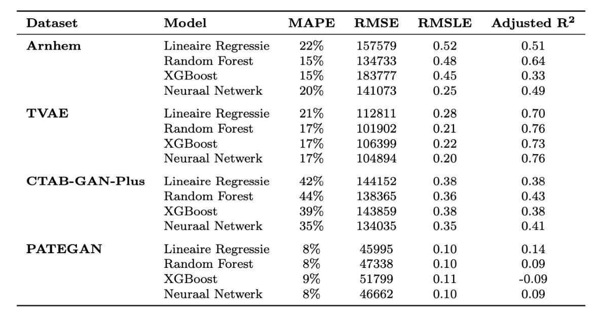
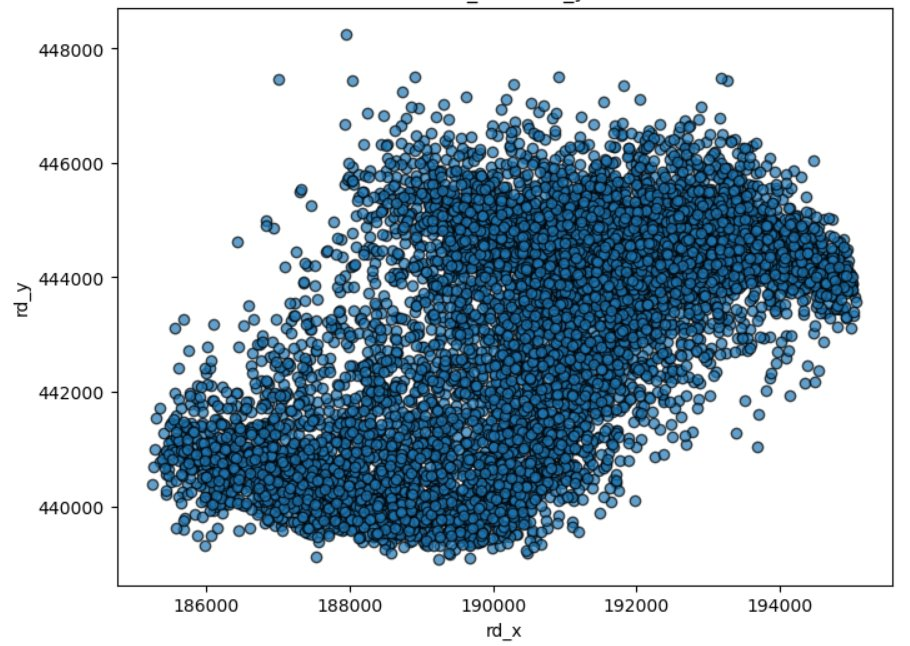

# Synthetische Data en Privacy in de Woningmarkt

## Introductie

Vanwege privacywetgeving, zoals de AVG, worden datasets steeds minder toegankelijk.  
Synthetische data kan hierin een oplossing bieden: door het genereren van kunstmatige datasets met vergelijkbare statistische eigenschappen als echte data, blijft analyse mogelijk zonder inbreuk op de privacy van individuen.

Dit onderzoek richt zich op de toepasbaarheid van synthetische data binnen de woningmarkt, met een specifieke focus op Arnhem. Drie synthetische datageneratiemethoden—CTAB-GAN+, TVAE en PATEGAN—werden geëvalueerd op zowel modelprestaties als privacybescherming.

## Methodologie

Voor dit onderzoek is gebruikgemaakt van de BAG met koopsommen en coördinaten toegevoegd. De volgende generatieve modellen zijn ingezet:

- **CTAB-GAN+**: Een geavanceerd generatief model specifiek ontworpen voor tabulaire data.
- **TVAE**: Een variational autoencoder die latente structuren in de data leert en reproduceert.
- **PATEGAN**: Een privacygericht generatief model dat gebruikmaakt van differentiële privacytechnieken.

## Evaluatiemetrieken

De modellen zijn beoordeeld op:

- Voorspellingskwaliteit met MAPE, RMSE, RMSLE en Adjusted R².
- Privacybescherming via K-anonimiteit en Identifiability Score.

### K-anonimiteit en Identifiability Score

K-anonimiteit is een privacymaatstaf die aangeeft hoeveel records in een dataset identieke waarden hebben voor een set gevoelige attributen.  
Een hogere K-waarde betekent een grotere anonimiteit en minder kans op herleidbaarheid van individuele gegevens.

De Identifiability Score is een maat voor de waarschijnlijkheid dat een synthetisch gegenereerd record kan worden gekoppeld aan een origineel record.  
Een lagere score duidt op een hoger niveau van privacybescherming.

## Resultaten

### Modelprestaties

Uit de evaluatie blijkt dat synthetische data gebruikerswaarde behoudt, maar dat de prestaties variëren per model. De onderstaande tabel laat de resultaten voor Arnhem zien.

#### Modelprestaties Arnhem:

- **CTAB-GAN+** scoorde lager op nauwkeurigheid, maar scoorde het meest dichtbij het origineel, wat aantoont dat de gegenereerde data een hoge mate van representativiteit behoudt.
- **TVAE** presteerde het best op de modellen: met een lage RMSE en een relatief hoge Adjusted R²-score, wat duidt op een sterke overeenkomst met echte data.
- **PATEGAN** presteerde goed op foutmarges (MAPE en RMSE), maar Adjusted R² was laag, wat betekent dat de onderlinge relaties in de dataset minder goed worden gerepresenteerd.

  
*Figuur 1 - Vergelijking van de modelprestaties.*

De visualisaties van de lineaire regressie geven een duidelijk beeld van hoe dicht de synthetisch gegenereerde data (CTAB-GAN+, TVAE en PATE) bij de oorspronkelijke dataset ligt. Zo wordt ook visueel duidelijk waarom PATE bij sommige modellen een relatief lage R² behaalt: in de grafieken is zichtbaar dat de voorspellingen verder afwijken van de werkelijke waarden dan bij andere methoden.

  
*Figuur 2 - Lineaire Regressie plots.*

Daarnaast valt op dat de schaal van plot (e), iets afwijkt van de andere plots. Dit komt door enkele grote uitschieters in de originele data. Het is interessant om te zien hoe de synthetische datageneratiemethoden met deze outliers omgaan: sommige modellen lijken robuuster en weten de extreme waarden beter te benaderen, terwijl andere juist meer spreiding in de voorspellingen laten zien. Hiermee wordt direct zichtbaar hoe sterk (of minder sterk) elk model met uitzonderlijke data kan omgaan en hoe die uitschieters het algemene voorspellingstraject beïnvloeden.

### Privacybescherming

Privacy is een cruciaal aspect bij synthetische data. De tabel hieronder toont de resultaten van de privacy-analyse.

#### Privacy-evaluatie Arnhem:

- **PATEGAN** biedt de hoogste privacybescherming, met de hoogste K-anonimiteit en de laagste Identifiability Score.
- **TVAE** scoorde het laagst op K-anonimiteit, maar biedt nog steeds een acceptabel beschermingsniveau.
- **CTAB-GAN+** heeft een betere privacybescherming dan TVAE, maar scoort minder goed dan PATEGAN.

  
*Figuur 3 - Vergelijking van privacybescherming tussen modellen.*

### Ruimtelijke Analyse van de Synthetische Data

Voor woningmarktanalyses is de ruimtelijke verdeling van woningen essentieel. In de scatterplot hieronder lijkt de synthetische data niet overeen te komen met de echte data.

  
*Figuur 4 - Ruimtelijke verdeling van de synthetische dataset.*

Echter, wanneer we de statistische verdeling van de coördinaten bekijken, blijkt dat de synthetische data wel de juiste spreiding heeft.

  
  

*Figuur 5 - verdeling van de coordinaten.*

Dit komt doordat de algemene datageneratiemethoden goed zijn in het nabootsen van de dataspreiding, maar moeite hebben met het vastleggen van de relatie tussen x- en y-coördinaten. Hierin presteert het GeoPointGAN-model aanzienlijk beter, zoals te zien is aan de bijgevoegde plots.

  
  
  

*Figuur 4 - Ruimtelijke verdeling van de echte en synthetische dataset GeoPointGan.*

## Conclusie

CTAB-GAN+ blijkt zeer effectief in het nauwkeurig reproduceren van complexe datapatronen. Dit maakt het model geschikt voor situaties waar datakwaliteit prioriteit heeft. TVAE biedt een goede balans tussen privacy en bruikbaarheid, wat het toepasbaar maakt op verschillende typen datasets. PATEGAN onderscheidt zich door zijn ingebouwde differentiële privacymechanismen, die resulteren in een hoge K-anonimisatie en lage Identifiability Score. Echter vertoont de methode wisselende prestaties wat betreft de algehele datakwaliteit.

Deze bevindingen tonen aan dat synthetische datageneratie een effectieve oplossing kan zijn om privacy te beschermen en tegelijkertijd data toegankelijk te maken voor woningmarktonderzoek. Aangezien financiële gegevens van personen zeer gevoelig zijn, is PATEGAN op dit moment de meest geschikte optie. Deze aanpak minimaliseert het risico op herleiding naar individuele persoonsgegevens, terwijl de data nog steeds bruikbaar blijft voor verdere analyse.

---

**Door: Yoran Bakker**
